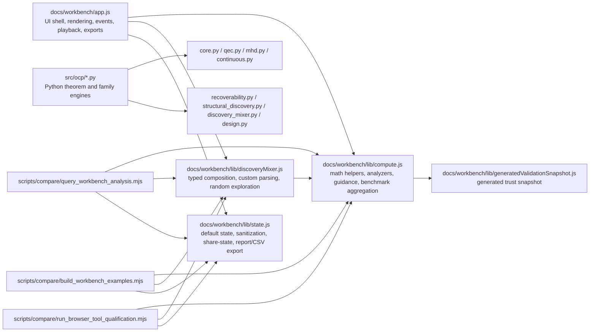

# Architecture Audit Report

## Scope

This report is the **Lane 1** audit only.

It evaluates:
- workbench frontend structure
- engine / backend calculation flow
- state management
- routing and navigation structure
- generated artifact loading
- export/report paths
- module boundaries
- template and studio integration surfaces
- benchmark / validation console integration
- app-facing discovery / recoverability layering

It does **not** treat passing tests as proof of good architecture.
It does **not** treat functional correctness as equivalent to maintainability.

## Executive Verdict

Current state: **structurally mixed**.

The codebase is not a pile of random hacks, but it is carrying too much logic inside a small number of files. The strongest architectural positive is that the import graph is still mostly acyclic and the major concepts are still recognizable. The strongest negative is that the physical code boundaries no longer match the conceptual product boundaries.

The repo now behaves like it has distinct product modules:
- Structural Discovery Studio
- Discovery Mixer
- Benchmark / Validation Console
- Exact / QEC / Physics labs

But in code, much of that still collapses into:
- one very large page controller
- one very large analysis engine
- one large advanced-lab engine
- one state/export module with multiple responsibilities

## Architecture Map

## Dependency Map

### Workbench JS dependency map

- [app.js](../workbench/app.js) -> `compute.js`, `discoveryMixer.js`, `state.js`
- [compute.js](../workbench/lib/compute.js) -> `generatedValidationSnapshot.js`
- [discoveryMixer.js](../workbench/lib/discoveryMixer.js) -> `compute.js`
- [state.js](../workbench/lib/state.js) -> no local imports

### Python OCP dependency map

- [core.py](../../src/ocp/core.py) -> none
- [continuous.py](../../src/ocp/continuous.py) -> `core`
- [physics.py](../../src/ocp/physics.py) -> `mhd`
- [cfd.py](../../src/ocp/cfd.py) -> `mhd`, `physics`
- [design.py](../../src/ocp/design.py) -> `recoverability`
- [structural_discovery.py](../../src/ocp/structural_discovery.py) -> `design`, `cfd`, `physics`, `recoverability`
- [discovery_mixer.py](../../src/ocp/discovery_mixer.py) -> `recoverability`, `structural_discovery`

### Architectural conclusion from the graphs

Positive:
- the dependency graph is still mostly acyclic
- lower-level physics and theorem kernels remain more disciplined than the workbench shell
- there is still a recognizable layering from low-level exact branches upward

Negative:
- workbench scripts and tests import runtime code directly from `docs/workbench/lib`
- the frontend analysis engine is not isolated as a reusable product-core package
- generated validation artifacts live in a runtime import path
- conceptual modules are not physically separated into matching code modules

## High-Risk Files / Modules

### Highest risk

- [app.js](../workbench/app.js)
  - about 3003 lines
  - about 71 functions
  - owns shell rendering, per-lab rendering, event wiring, scenario storage, hash sync, playback logic, exports, SVG generation, and canvas hydration
- [compute.js](../workbench/lib/compute.js)
  - about 2881 lines
  - about 137 functions
  - mixes low-level linear algebra, family-specific numerical engines, product-facing guidance text, benchmark aggregation, and view-model shaping
- [discoveryMixer.js](../workbench/lib/discoveryMixer.js)
  - about 937 lines
  - duplicates some helper logic from `compute.js`
  - owns typed parsing, custom input reduction, structured mode, random mode, and recommendation logic
- [recoverability.py](../../src/ocp/recoverability.py)
  - about 2039 lines
  - now acts as the central catch-all for multiple recoverability families, metrics, sweeps, and theorem-adjacent helpers

### Medium risk

- [state.js](../workbench/lib/state.js)
  - moderate size, but combines persistence, share-state encoding, evidence classification, markdown report generation, and CSV export policy
- [run_professional_validation_audit.py](../../scripts/compare/run_professional_validation_audit.py)
  - very useful, but now large enough that it is becoming a second orchestration monolith

## Duplication List

### Confirmed duplication

- `diagonalRecordMatrix`
  - duplicated in [compute.js](../workbench/lib/compute.js) and [discoveryMixer.js](../workbench/lib/discoveryMixer.js)
- `solveLeastSquares`
  - duplicated in [compute.js](../workbench/lib/compute.js) and [discoveryMixer.js](../workbench/lib/discoveryMixer.js)
- diagonal/history threshold logic
  - conceptually duplicated between workbench JS and Python-side [recoverability.py](../../src/ocp/recoverability.py)
- restricted-linear logic
  - appears in Python theorem engine, JS recoverability engine, JS mixer logic, and qualification scripts
- report/export semantics
  - split between [app.js](../workbench/app.js), [state.js](../workbench/lib/state.js), and query/validation scripts

### Architectural significance

This duplication is not yet catastrophic, but it creates a real drift surface. The analytic `selectedDelta` mismatch that was recently fixed is exactly the kind of bug that duplicated frontend/backend logic makes more likely.

## Dead / Stale Code List

Static repo scan suggests these are currently unused or effectively orphaned inside the workbench code:

- [compute.js](../workbench/lib/compute.js)
  - `formatMatrix`
  - `curl2d`
  - `lowPassField`
  - `velocityFromVorticity`
  - `diagonalRecoveryWeights`
  - `analyzeStructuralDiscovery`
  - `cSub`
- [discoveryMixer.js](../workbench/lib/discoveryMixer.js)
  - `capitalize`
  - `parseNumericRows`

These should not all be deleted blindly, but they are exactly the kind of functions that accumulate when a system grows by extension rather than by periodic consolidation.

## Coupling / Tangling List

### 1. UI shell mixed with application logic

[app.js](../workbench/app.js) contains:
- module metadata
- external literature links
- state mutation
- lab selection dispatch
- rendering
- event binding
- export triggers
- SVG and canvas rendering helpers
- playback orchestration

This makes the file hard to reason about and expensive to change safely.

### 2. Backend math mixed with product guidance

[compute.js](../workbench/lib/compute.js) contains both:
- mathematical kernels and numerical helpers
- product-facing classification strings
- recommendation generation
- theorem-status strings
- benchmark console aggregation

That boundary should be cleaner. The current file is both analysis engine and presentation-facing view-model adapter.

### 3. Persistence mixed with reporting

[state.js](../workbench/lib/state.js) owns:
- default state
- share-state encoding/decoding
- state sanitization
- evidence-level labeling
- markdown report formatting
- CSV export formatting

Those are related, but not the same responsibility.

### 4. Validation scripts depend on docs runtime path

Scripts such as:
- [query_workbench_analysis.mjs](../../scripts/compare/query_workbench_analysis.mjs)
- [build_workbench_examples.mjs](../../scripts/compare/build_workbench_examples.mjs)
- [run_browser_tool_qualification.mjs](../../scripts/compare/run_browser_tool_qualification.mjs)

import directly from:
- [compute.js](../workbench/lib/compute.js)
- [discoveryMixer.js](../workbench/lib/discoveryMixer.js)
- [state.js](../workbench/lib/state.js)

That means the docs/workbench path is also serving as the app-engine package. It works, but it is a long-term maintenance smell.

### 5. Hidden global assumptions

[app.js](../workbench/app.js) relies on module-level mutable globals:
- `state`
- `latestAnalysis`
- `savedScenarios`
- `playbackTimer`
- `playbackLab`

This is manageable now, but it is a brittle base for further feature growth.

## Workbench Modules That Should Be Split or Merged

### Should be split

- [app.js](../workbench/app.js)
  - split into shell/navigation, per-lab renderers, event handlers, and chart/export helpers
- [compute.js](../workbench/lib/compute.js)
  - split into shared math utilities, branch analyzers, physics numerics, and benchmark aggregation
- [state.js](../workbench/lib/state.js)
  - split into persistence/share-state and export/report formatters

### Should be merged or consolidated

- duplicate linear algebra and control helpers between [compute.js](../workbench/lib/compute.js) and [discoveryMixer.js](../workbench/lib/discoveryMixer.js)
- duplicate family logic between frontend JS and Python scripts where one side is only being used as a product-core replica

### Conceptual overlap to clean up

The product language distinguishes:
- Structural Discovery Studio
- Recoverability / Observation Studio

But code and runtime behavior place both inside the same active lab. This is not wrong, but the naming and conceptual surfaces should be consolidated more explicitly so the code and the product story match.

## What Is Clean And Should Be Preserved

- the JS import graph is still acyclic and simple
- lower-level Python theorem kernels remain cleaner than the workbench shell
- unsupported handling is explicit rather than silent in the advanced surfaces
- benchmark/trust snapshot generation is a good pattern and worth preserving
- the repo still has a clear distinction between theorem-backed, family-specific, and unsupported results
- the active-lab dispatch model is easy to trace even though it is too centralized

## Documentation Drift

The docs are still strong on capability and research scope, but there is a mild code-structure mismatch:
- documentation presents distinct product modules
- code still physically implements much of that as branch-heavy sections inside a single page controller and a single analysis file

This is not a user-facing lie, but it is a developer-facing mismatch.

## Recommended Separations

1. Move the JS analysis core out of `docs/workbench/lib` into a shared product-core location.
2. Split [app.js](../workbench/app.js) by responsibility:
   - shell and navigation
   - lab renderers
   - event binding
   - visualization helpers
3. Extract shared linear algebra and threshold helpers into a single JS engine utility module.
4. Split [state.js](../workbench/lib/state.js) into:
   - persistence / share-state
   - export / report formatting
   - evidence-level metadata
5. Treat generated validation snapshot loading as a view-layer concern rather than a hard dependency of the compute core.

## Recommended Consolidations

1. Consolidate duplicate control/history helpers.
2. Consolidate duplicate restricted-linear helper logic.
3. Consolidate export availability policy into a single per-lab capability map.
4. Consolidate module metadata, quickstarts, presets, and external-link data into separate data files.

## Recommended Rewrites

### Highest-value rewrite

- rewrite [app.js](../workbench/app.js) into a small shell plus per-lab modules

### Second highest-value rewrite

- rewrite [compute.js](../workbench/lib/compute.js) into a true analysis package with narrower files

### Third rewrite

- reduce JS/Python drift risk by moving scripts/tests off the docs path and onto a shared analysis-core interface

## Prioritized Refactor Plan

1. **Create a shared JS analysis-core package**
   - remove direct script/test imports from `docs/workbench/lib`
2. **Split the workbench shell**
   - separate rendering, state transitions, and chart/export helpers
3. **Remove duplicated helpers between `compute.js` and `discoveryMixer.js`**
4. **Split `state.js` into persistence and export layers**
5. **Move metadata/constants out of `app.js`**
6. **Cull or re-home currently unused helper functions**
7. **Add a developer-facing workbench architecture doc**

## Bottom-Line Lane 1 Classification

The app codebase is **not structurally broken**, but it is drifting toward a patch-heavy monolith at the workbench layer.

Current classification:
- **structurally usable, but carrying real refactor debt**
- safe to maintain in the short term
- not a good base for another major feature wave without decomposition first
