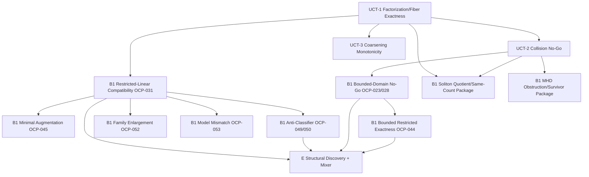

# Theorem Dependency Map

Date: 2026-04-17

## 1) Dependency Graph (Logical)

## 2) Dependency Notes

1. `UCT-1` is the primary abstract root for recoverability statements.
2. `UCT-2` is a no-go corollary of `UCT-1` and supports multiple branch obstruction packages.
3. Restricted-linear package (`OCP-031`,`045`,`049`,`050`,`052`,`053`) forms the densest theorem chain.
4. Bounded-domain positive theorem (`OCP-044`) depends on no-go boundary logic to prevent overpromotion.
5. Soliton and MHD packages map to root core via restricted translations, not full identity.
6. Engineering layers depend on theorem packages; they do not sit above them.

## 3) Governance Dependency Rule

A result may only be promoted upward in hierarchy if all of its parent assumptions/dependencies are satisfied in the target branch.
