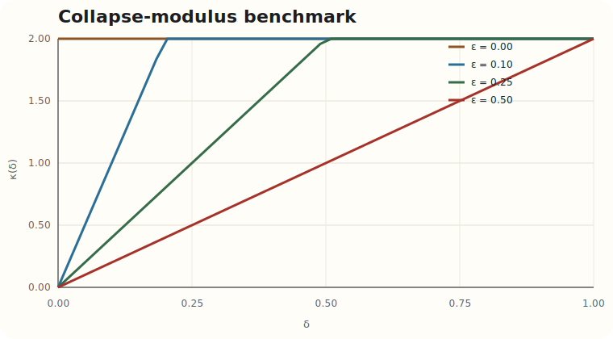
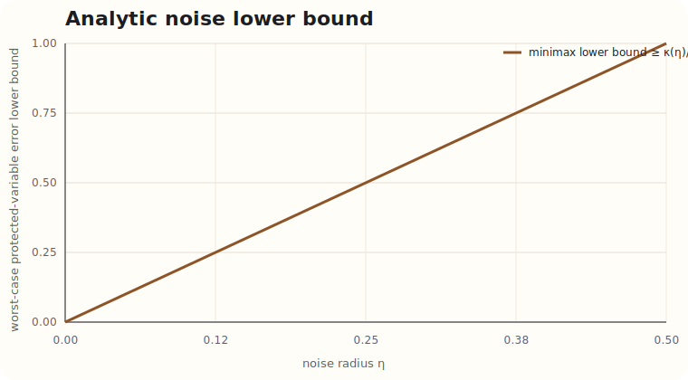
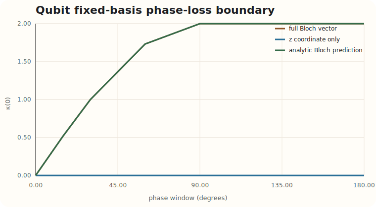
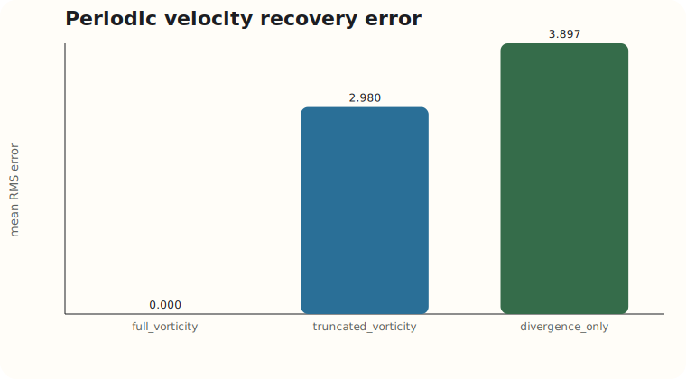
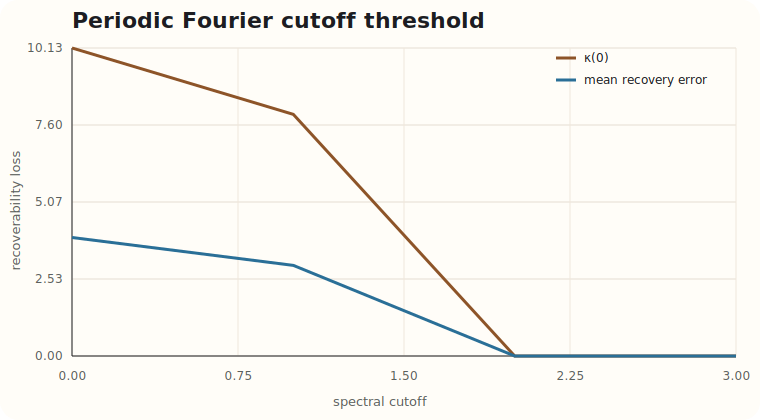
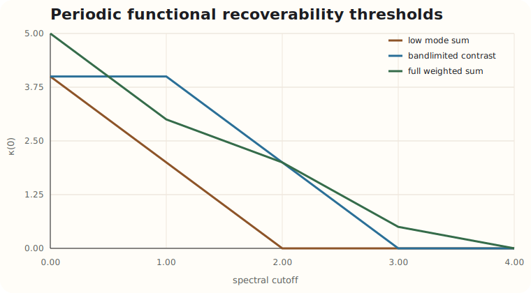
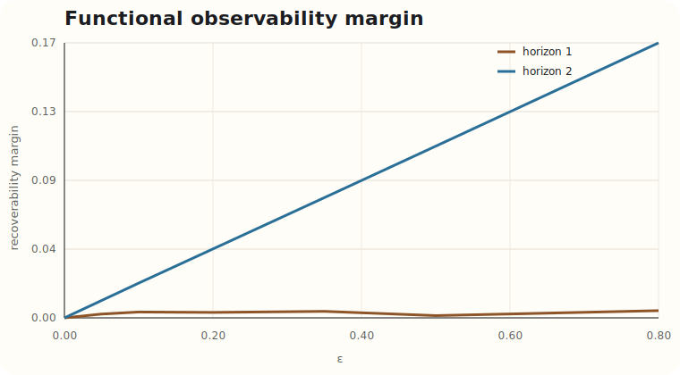
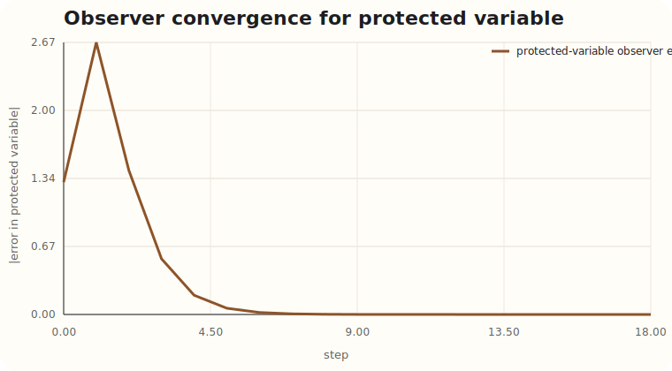
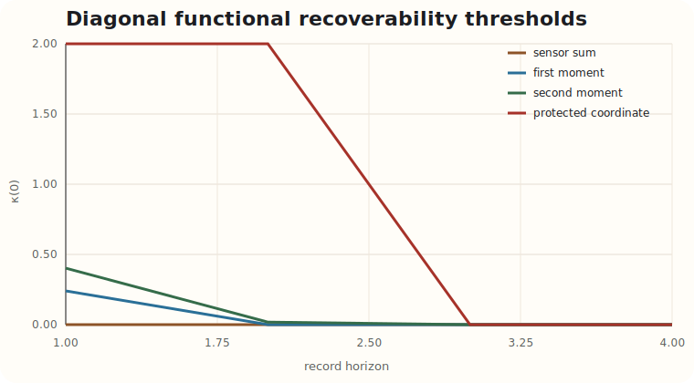

# Constrained-Observation Recoverability Results Report

## Abstract

This report documents the current research-stage execution pass of the **Constrained-Observation Recoverability** branch inside **Protected-State Correction Theory**.

The branch asks when a constrained record preserves enough information to recover a protected variable exactly, approximately, asymptotically, or not at all.

Current honest outcome:

- the branch does produce a clean formal layer,
- it does produce useful no-go and threshold structure,
- it does produce reproducible computational benchmarks,
- but it still does **not** justify a claim of a major new general theorem.

The strongest surviving outputs are:

1. the exact / approximate / asymptotic / impossible classification for protected variables,
2. the operational lower bound `worst-case protected-variable error ≥ κ_{M,p}(η)/2`,
3. a restricted-linear minimal-complexity criterion based on row-space inclusion,
4. a periodic functional-support threshold law on a conventional incompressible family,
5. a diagonal functional-interpolation threshold law in a scalar-output control family,
6. a same-record weaker-versus-stronger recovery split in both periodic and control families,
7. and several strong negative results that survive repeated falsification.

## 1. Research Question

The main repo already studies what happens once a protected/disturbance split and a correction operator exist.

This branch asks a prior question:

> does the available record preserve enough information for exact recovery, stable approximation, asymptotic reconstruction, or no recovery at all?

That question is conventional in spirit, but the branch only deserves to stay if it supports sharper and more testable outcomes than “information was lost.”

## 2. Conventional Background

Relevant standard areas:

- quantum recoverability and sufficiency,
- inverse-problem stability,
- restricted recovery,
- functional observability,
- observer design,
- constrained PDE reconstruction.

Already standard:

- exact recoverability on a family is a fiber / sufficiency issue,
- approximate recoverability is a stability issue,
- asymptotic recoverability belongs naturally to observer theory,
- failure often arises from noninjectivity or loss of distinguishability.

The branch-specific question is narrower:

- whether a **protected-variable** framing gives a cleaner exactness/no-go story across several conventional lanes,
- whether the collapse modulus `κ_{M,p}` does real work,
- whether any sharp threshold or minimal-record law survives repeated testing.

## 3. Formal Setup

The branch works with:

- state space `X`,
- admissible family `A ⊂ X`,
- protected-variable map `p : A → P`,
- observation map `M : A → Y`,
- recovery map `R : M(A) → P`.

Exact recoverability means

```text
R(M(x)) = p(x)    for all x ∈ A.
```

The branch obstruction is the fiber-collision condition

```text
M(x)=M(x')  but  p(x)≠p(x').
```

The central scalar is the collapse modulus

```text
κ_{M,p}(δ) = sup { d_P(p(x),p(x')) : d_Y(M(x),M(x')) ≤ δ }.
```

This gives the exact criterion

```text
κ_{M,p}(0)=0.
```

It also gives the operational robust-recovery lower bound

```text
worst-case protected-variable error ≥ κ_{M,p}(η)/2.
```

For finite-dimensional linear families `x=Fz`, the clean exact criterion is

```text
ker(O F) ⊂ ker(L F),
```

or equivalently

```text
row(L F) ⊂ row(O F).
```

That row-space formulation is what powers the strongest current threshold results.

## 4. Derivations Kept In The Branch

The detailed mathematics is written in:

- [constrained-observation-formalism.md](constrained-observation-formalism.md)
- [constrained-observation-derivations.md](constrained-observation-derivations.md)
- [constrained-observation-theorems.md](../../theorem-candidates/constrained-observation-theorems.md)
- [constrained-observation-no-go.md](../../impossibility-results/constrained-observation-no-go.md)

Kept derivations:

1. fiber-separation exactness,
2. `κ(0)=0` exactness criterion,
3. adversarial lower bound `κ(η)/2`,
4. restricted linear criterion `ker(O F) ⊂ ker(L F)`,
5. restricted rank lower bound,
6. nested minimal-complexity criterion via row-space inclusion,
7. same-record weaker-versus-stronger split,
8. divergence-only no-go,
9. fixed-basis phase-loss law,
10. periodic functional-support theorem,
11. diagonal functional-interpolation theorem.

## 5. Computational Setup

Experiment runner:

- [run_recoverability_examples.py](../../../scripts/compare/run_recoverability_examples.py)

Generated artifacts:

- [recoverability_summary.json](../../../data/generated/recoverability/recoverability_summary.json)
- [analytic_collapse_benchmark.csv](../../../data/generated/recoverability/analytic_collapse_benchmark.csv)
- [analytic_noise_lower_bound.csv](../../../data/generated/recoverability/analytic_noise_lower_bound.csv)
- [qubit_record_sweep.csv](../../../data/generated/recoverability/qubit_record_sweep.csv)
- [periodic_velocity_sweep.csv](../../../data/generated/recoverability/periodic_velocity_sweep.csv)
- [periodic_cutoff_sweep.csv](../../../data/generated/recoverability/periodic_cutoff_sweep.csv)
- [periodic_protected_complexity_sweep.csv](../../../data/generated/recoverability/periodic_protected_complexity_sweep.csv)
- [periodic_functional_complexity_sweep.csv](../../../data/generated/recoverability/periodic_functional_complexity_sweep.csv)
- [functional_observability_sweep.csv](../../../data/generated/recoverability/functional_observability_sweep.csv)
- [control_minimal_complexity_sweep.csv](../../../data/generated/recoverability/control_minimal_complexity_sweep.csv)
- [diagonal_functional_complexity_sweep.csv](../../../data/generated/recoverability/diagonal_functional_complexity_sweep.csv)

Figures:

- [analytic-collapse-benchmark.svg](../../assets/recoverability/analytic-collapse-benchmark.svg)
- [analytic-noise-lower-bound.svg](../../assets/recoverability/analytic-noise-lower-bound.svg)
- [qubit-phase-loss.svg](../../assets/recoverability/qubit-phase-loss.svg)
- [periodic-velocity-errors.svg](../../assets/recoverability/periodic-velocity-errors.svg)
- [periodic-cutoff-threshold.svg](../../assets/recoverability/periodic-cutoff-threshold.svg)
- [periodic-protected-threshold.svg](../../assets/recoverability/periodic-protected-threshold.svg)
- [periodic-functional-threshold.svg](../../assets/recoverability/periodic-functional-threshold.svg)
- [functional-observability-margin.svg](../../assets/recoverability/functional-observability-margin.svg)
- [observer-convergence.svg](../../assets/recoverability/observer-convergence.svg)
- [control-history-threshold.svg](../../assets/recoverability/control-history-threshold.svg)
- [control-minimal-horizon.svg](../../assets/recoverability/control-minimal-horizon.svg)
- [diagonal-functional-threshold.svg](../../assets/recoverability/diagonal-functional-threshold.svg)

## 6. Experiment Families

### 6.1 Analytic benchmark

Model:

```text
M_ε(u,v) = (u, εv),
p(u,v)=v,
(u,v) ∈ [-1,1]^2.
```

For this model,

```text
κ_ε(δ) = min(2, δ/|ε|)    for ε ≠ 0,
κ_0(δ) = 2.
```

This is the branch's cleanest closed-form sanity check.

### 6.2 Qubit fixed-basis family

Family:

```text
|ψ(θ,φ)⟩ = cos(θ/2)|0⟩ + e^{iφ} sin(θ/2)|1⟩.
```

Record:

```text
M_Z(θ,φ) = (cos²(θ/2), sin²(θ/2)).
```

Protected variables tested:

- full Bloch vector,
- `z` coordinate only.

### 6.3 Periodic incompressible-flow families

Two conventional periodic lanes were kept.

1. **velocity reconstruction lane**
   - two-mode family,
   - observations: full vorticity, truncated vorticity, divergence only,
   - protected variable: full velocity field.

2. **modal complexity lane**
   - four-mode family,
   - observations: low-pass truncated vorticity,
   - protected variables:
     - first modal coefficient,
     - first two modal coefficients,
     - low-mode sum,
     - bandlimited contrast,
     - full weighted sum,
     - full four-mode coefficient vector.

### 6.4 Functional-observability control families

Two control lanes were kept.

1. **two-state observer lane**

```text
x_{t+1} = diag(a,b)x_t,
y_t = x_{t,1} + ε x_{t,2},
p(x_0)=x_{0,2},
(a,b)=(0.95,0.65).
```

2. **three-state diagonal threshold lane**

```text
x_{t+1} = diag(0.95, 0.8, 0.65)x_t,
y_t = c_1 x_{t,1} + c_2 x_{t,2} + c_3 x_{t,3}.
```

Sensor profiles tested:

- `three_active = (1.0, 0.4, 0.2)`
- `two_active = (1.0, 0.0, 0.2)`
- `protected_hidden = (1.0, 0.4, 0.0)`

Protected functionals tested:

- `sensor_sum`
- `first_moment`
- `second_moment`
- `protected_coordinate`

## 7. Results

### 7.1 Analytic benchmark



Key results:

- `ε=0` gives `κ(0)=2`, so exact recovery is impossible.
- every tested `ε>0` gives `κ(0)=0`, so exact recovery is logically possible.
- smaller `ε` produces stronger sensitivity under record perturbation.

This is not novel. It is useful because it gives one fully auditable family where the branch classification is known in closed form.

The lower-bound curve also tracks the exact formula for the robust obstruction:



For `ε=0.25`, representative values are:

- `η=0.05` gives lower bound `0.10`
- `η=0.10` gives lower bound `0.20`
- `η=0.20` gives lower bound `0.40`
- `η=0.50` gives lower bound `1.00`

### 7.2 Qubit phase-loss sweep



For the full Bloch-vector protected variable:

- `w=0°`: exact, `κ(0)=0`
- `w=15°`: impossible, `κ(0)≈0.518`
- `w=30°`: impossible, `κ(0)=1.0`
- `w=90°`: impossible, `κ(0)=2.0`
- `w=180°`: impossible, `κ(0)=2.0`

For the weaker protected variable `z=cos θ`:

- exact throughout the tested phase-window range, with `κ(0)=0` in every sampled case.

This is one of the branch's cleanest structural observations:

> the same record can be exact for one protected variable and impossible for a stronger one.

That is not a novelty claim by itself, but it is exactly the kind of branch behavior worth preserving.

### 7.3 Periodic velocity recovery sweep



Results on the two-mode family:

- **full vorticity**:
  - exact recoverable: `True`
  - mean RMS recovery error: `1.20e-15`
  - max RMS recovery error: `1.58e-15`
  - `κ(0)=0`
- **truncated vorticity**:
  - exact recoverable: `False`
  - mean RMS recovery error: `2.98`
  - max RMS recovery error: `3.97`
  - `κ(0)≈7.95`
- **divergence only**:
  - exact recoverable: `False`
  - mean RMS recovery error: `3.90`
  - max RMS recovery error: `5.07`
  - `κ(0)≈10.13`

Interpretation:

- full vorticity is an exact protected-variable record,
- low-mode truncation leaves an approximate-only lane,
- divergence only is a clean no-go.

That result also tightens into a family-level threshold law on the same two-mode family:



- cutoff `0`: impossible, observation rank `0`, protected rank `2`
- cutoff `1`: impossible, observation rank `1`, protected rank `2`
- cutoff `2`: exact, observation rank `2`, protected rank `2`
- cutoff `3`: exact, observation rank `2`, protected rank `2`

This is a real coarsening threshold on the finite periodic family:

> exact recovery switches on exactly when the record retains both active modes.

### 7.4 Periodic functional complexity sweep



The stronger current result comes from changing the protected variable rather than keeping it fixed at the full velocity field or at a selected coefficient subset.

For the four-mode modal family:

- **protected variable: low-mode sum**
  - predicted minimal cutoff: `2`
  - exact at cutoffs `2,3,4`
  - impossible below that
- **protected variable: bandlimited contrast**
  - predicted minimal cutoff: `3`
  - exact at cutoffs `3,4`
  - impossible below that
- **protected variable: full weighted sum**
  - predicted minimal cutoff: `4`
  - exact only at cutoff `4`
  - impossible at `0,1,2,3`

Representative `κ(0)` values:

- `low_mode_sum`:
  - cutoff `1`: `κ(0)=2.0`
  - cutoff `2`: `κ(0)=0`
- `bandlimited_contrast`:
  - cutoff `2`: `κ(0)=2.0`
  - cutoff `3`: `κ(0)=0`
- `full_weighted_sum`:
  - cutoff `3`: `κ(0)=0.5`
  - cutoff `4`: `κ(0)=0`

This is one of the branch's strongest current results:

> minimal exact record complexity depends on the protected variable, not just on the ambient family.

It survived four checks:

1. direct kernel derivation,
2. independent row-space residual checks,
3. independent pseudoinverse recovery,
4. discretization changes from `n=18` to `n=24`.

It also gives a clean weaker-versus-stronger split under the same record:

- at cutoff `2`, `low_mode_sum` is exact while `bandlimited_contrast` and `full_weighted_sum` are not
- at cutoff `3`, `bandlimited_contrast` is exact while `full_weighted_sum` is still impossible

### 7.5 Functional observability and asymptotic observer sweep



For the two-state family with `ε=0.2`:

- horizon `1`:
  - exact recoverable: `False`
  - collision gap: `2.0`
  - sampled recoverability margin: `0.00345`
  - mean recovery error: `5.56e-1`
- horizon `2`:
  - exact recoverable: `True`
  - collision gap: `0`
  - sampled recoverability margin: `0.04366`
  - max recovery error: `5.44e-15`
- horizon `3`:
  - exact recoverable: `True`
  - sampled margin: `0.07237`

For `ε=0`, exact recovery fails at every tested horizon because the protected coordinate never enters the record.

Observer result for `ε=0.2`:



- observer gain: `[1.625, -2.625]`
- spectral radius of error dynamics: `0.3`
- protected-variable error drops from `1.3` to `1.14e-8` by step `18`

Interpretation:

- one-shot exact recovery can fail,
- finite-history exact recovery can then switch on,
- asymptotic recovery can still remain meaningful from the ongoing record.

### 7.6 Diagonal functional threshold sweep



This is the strongest current control-side threshold result, and it is stronger than the older coordinate-only story.

- **`three_active` profile**
  - `sensor_sum`: exact from `H=1`
  - `first_moment`: exact from `H=2`
  - `second_moment`: exact from `H=3`
  - `protected_coordinate`: exact from `H=3`
- **`two_active` profile**
  - `sensor_sum`: exact from `H=1`
  - `first_moment`: exact from `H=2`
  - `second_moment`: exact from `H=2`
  - `protected_coordinate`: exact from `H=2`
- **`protected_hidden` profile**
  - `sensor_sum`: exact from `H=1`
  - `first_moment`: exact from `H=2`
  - `second_moment`: exact from `H=2`
  - `protected_coordinate`: impossible for every tested horizon

Representative residuals and exactness checks:

- `three_active`, `second_moment`, `H=3`: interpolation residual `1.15e-15`
- `two_active`, `protected_coordinate`, `H=2`: interpolation residual `2.99e-15`
- `protected_hidden`, `protected_coordinate`, any `H`: exact recoverable `False`

All tested interpolation predictions matched the exactness classification from the independent restricted-linear criterion.

This is a real minimal-history result, albeit on a family where the proof reduces to distinct-eigenvalue interpolation. The older coordinate threshold remains true, but only as a special case of a stronger functional interpolation law.

## 8. Repeated Falsification Protocol And What Survived

Every promoted branch result was pressure-tested by:

1. derivation,
2. independent re-derivation or formula comparison,
3. explicit implementation,
4. edge or degenerate cases,
5. parameter perturbation or discretization changes,
6. comparison against conventional expectations,
7. raw-number versus figure cross-checks.

What survived cleanly:

- `κ(0)=0` exactness,
- `κ(η)/2` lower bound,
- qubit phase-window law,
- two-mode periodic cutoff threshold,
- four-mode periodic functional-support law,
- diagonal functional interpolation threshold,
- divergence-only and hidden-mode no-go structure,
- the same-record weaker-versus-stronger split.

What weakened under harder checking:

- vague “phase transition” language across the whole branch,
- any suggestion that the branch already supports one broad theorem spanning all anchor systems,
- any suggestion that `κ` is automatically a major new invariant.

## 9. What Was Actually Discovered

Useful outcomes:

1. `κ(0)` works exactly as the branch's exact / impossible separator should.
2. `κ(η)/2` survives as a real adversarial lower bound.
3. the same record can be exact for one protected variable and impossible for a stronger one.
4. the branch produces a clean restricted-linear minimal-complexity criterion that explains the strongest periodic and control thresholds.
5. the branch produces real finite-family minimal-record thresholds in both periodic-flow and control settings.
6. the divergence-only and hidden-mode no-go results are stronger and more useful than a generic “noninvertible maps are not invertible” slogan.

## 10. What Failed Or Stayed Weak

Weak or non-promotable outcomes:

- no broad new cross-domain phase-transition theorem emerged,
- most foundational propositions remain standard or near-standard,
- the branch still does not justify a major standalone theorem-program claim,
- some earlier sampled collision estimates were too optimistic and had to be replaced by exact nullspace-based calculations.

## 11. What Appears Standard

Almost certainly standard or standard-adjacent:

- fiber-separation exactness,
- restricted linear recovery by kernel inclusion,
- the row-space formulation of restricted exactness,
- fixed-basis phase-loss no-go in its basic form,
- divergence-only no-go in its basic form,
- two-step finite-history recovery formulas,
- the diagonal interpolation family as Vandermonde analysis.

## 12. What May Be A Real Contribution

The strongest plausible branch-level contribution is still modest:

- a protected-variable recoverability framework that cleanly separates exact, approximate, asymptotic, and impossible regimes,
- an operational use of `κ` through the lower bound `κ(η)/2`,
- a restricted-linear minimal-complexity criterion that becomes visible and useful in the branch language,
- and explicit minimal-record threshold laws showing that the protected variable matters as much as the record family.

That is a **minor but real** contribution candidate, not a major theorem claim.

## 13. What Is Not Worth Keeping

The branch should not be promoted around any of these by themselves:

- “measurement loses information,”
- “coarse records cause irrecoverability,”
- “noninvertible maps are not invertible,”
- “there is a universal recoverability phase transition law.”

## 14. Recommended Next Steps

1. Try to prove one theorem that upgrades the restricted-linear minimal-complexity criterion to a robust threshold theorem under controlled noise or admissible-family enlargement.
2. Push `κ` beyond `κ(0)=0` and `κ(η)/2`, or stop treating it as the branch's main novelty target.
3. Prefer stronger no-go results over vague cross-domain generalization.
4. Keep the branch even if no larger theorem emerges, because it now supports a real tool, real negative results, and real minimal-record examples.

## 15. Current Verdict

The branch survives.

It is worth keeping because:

- it integrates cleanly with the repo,
- it produces real no-go and threshold structure,
- it has a usable workbench lane,
- and it documents what did **not** survive.

It is **not** yet a major standalone theorem program.
