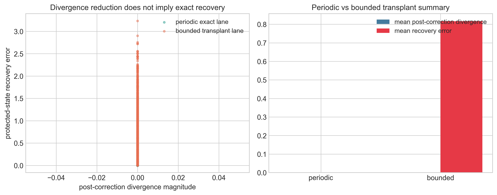
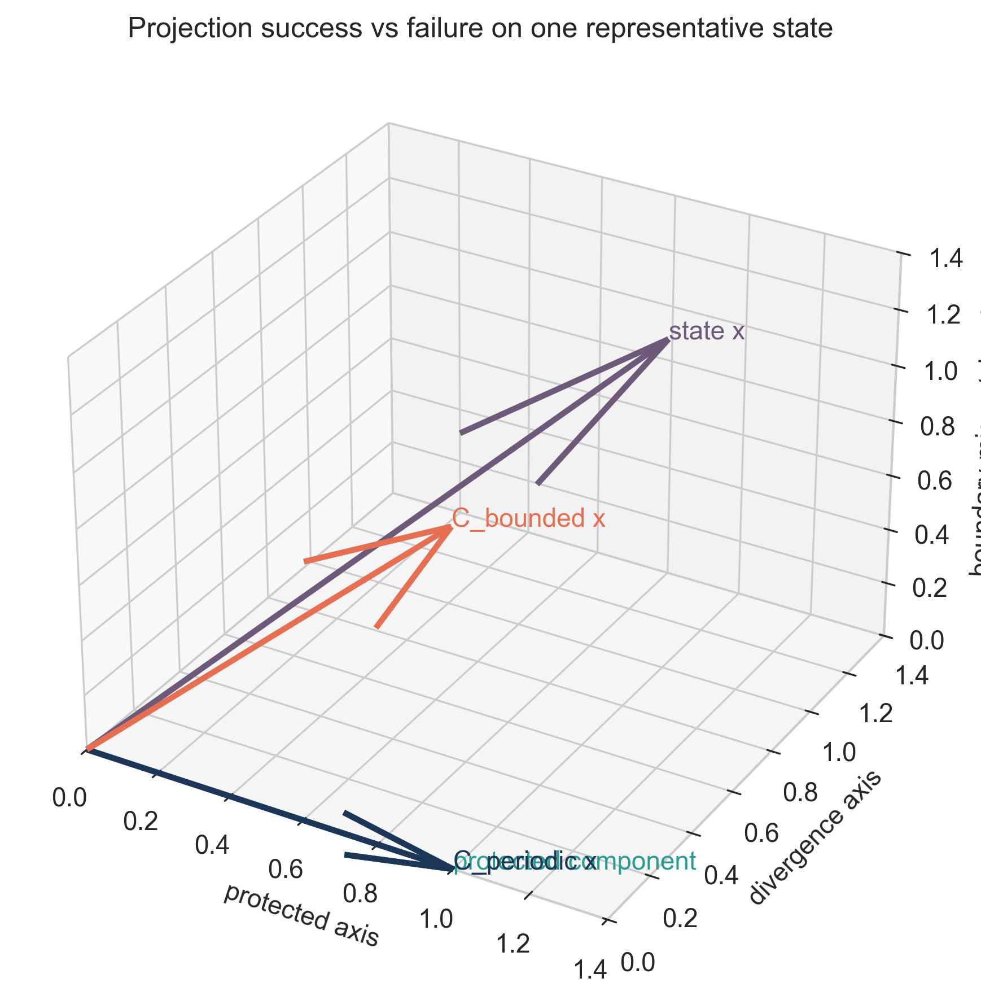
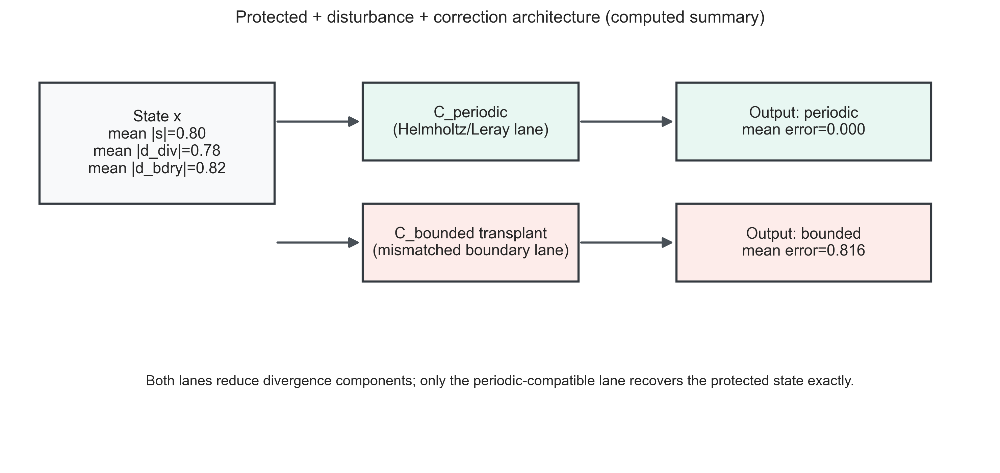

# Structure-Dependent Recoverability and Failure Modes in Projection-Based Correction Systems

Steven Reid  
Independent Researcher  
ORCID: 0009-0003-9132-3410  
sreid1118@gmail.com  
April 2026

## Abstract
Projection-based correction is often treated as a generic recipe: enforce one constraint (for example, low divergence) and infer full recovery. This paper isolates when that logic works and when it fails in a restricted but explicit setting. We contrast an exact periodic projection lane with a bounded-domain transplant failure lane, and then classify outcomes as exact, asymptotic-only, or impossible in the tested structure. The central message is architectural: success depends on compatibility between protected structure, domain class, and correction operator. Divergence reduction alone is not an exactness certificate on bounded classes. The paper is intentionally non-universal and states limits explicitly.

**Keywords:** projection methods, Helmholtz-Hodge decomposition, incompressible flow, bounded-domain obstruction, recoverability, structural mismatch

## 1. Introduction
Projection methods are central in incompressible-flow computation and many correction architectures. Yet practical usage often slides between two different claims:
1. a numerical claim (“divergence gets smaller”), and
2. a structural claim (“the protected state is exactly recovered”).

These claims coincide only under specific structural conditions. This paper develops a minimal comparative framework that keeps this distinction explicit.

## 2. Minimal Correction Framework
Let
- `x` denote the full state,
- `x_p` the protected component (e.g., boundary-compatible incompressible component),
- `x_d` disturbance/contamination (e.g., gradient contamination or incompatible boundary component),
- `C` a correction operator.

We call `C`:
- **exact** if `C(x_p + x_d) = x_p` on the declared family,
- **asymptotic** if repeated/continuous correction reduces defect but does not produce finite-step exactness,
- **impossible** if no operator in the stated architecture can recover `x_p` exactly.

## 3. Exact Success Case: Periodic Projection

### Theorem 3.1 (Periodic exact projection anchor)
On the implemented periodic family, Helmholtz/Leray projection exactly recovers the divergence-free protected component and is idempotent on that class.

**Status:** `PROVED` (CFD-T1).

### Theorem 3.2 (Periodic vorticity-to-velocity exactness)
On the implemented periodic mean-zero streamfunction family, vorticity inversion determines velocity exactly.

**Status:** `PROVED` (CFD-T2).

## 4. Failure Case: Bounded-Domain Transplant

### Theorem 4.1 (Naive periodic projector transplant failure)
Applying the periodic projection architecture to the bounded benchmark can drive divergence near zero while still violating the physically admissible boundary class.

**Status:** `PROVED` on the benchmark counterexample (CFD-N2 / proof-status map).

### Theorem 4.2 (Divergence-only insufficiency)
Distinct bounded-domain velocity fields can share identical divergence data; therefore divergence-only records do not determine the protected bounded velocity state.

**Status:** `PROVED` (CFD-T4 / CFD-N1).

## 5. Mechanism: Why Divergence Removal Is Not Enough
The failure mechanism is structural mismatch:
1. protected class on bounded domains encodes boundary-compatible geometry,
2. a periodic projector enforces the wrong decomposition for that boundary class,
3. therefore “constraint reduced” does not imply “target recovered.”

This is not an implementation bug; it is an architecture mismatch.

### 5.1 Boundary-Structure Mismatch in Operator Terms
Write the bounded protected class as

`V_prot = { u : ∇·u=0, u satisfies declared boundary class }`.

The bounded-domain exactness question is whether the correction operator satisfies

`C|_{V_prot} = I` and `C(v_prot + d) = v_prot` on the declared admissible disturbance family.

In the transplant failure lane, the imported periodic projector controls a divergence component but does not enforce the bounded boundary trace structure defining `V_prot`. This creates persistent same-divergence/different-state collisions, so exact bounded recovery fails even when divergence is numerically small.

Figure 1 demonstrates this directly: periodic and bounded-transplant lanes can show similarly strong post-correction divergence reduction, while recovery error remains near zero only in the periodic-compatible lane.

Figure 1. Divergence reduction versus actual protected-state recovery for periodic and bounded-transplant correction operators.

## 6. Restricted Positive Bounded Result

### Theorem 6.1 (Restricted bounded-domain Hodge exactness)
On an explicit boundary-compatible streamfunction family, the orthogonal projector onto the protected span recovers the protected component exactly.

**Status:** `PROVED` on explicit family (CFD-T3).

This theorem is intentionally restricted and should not be inflated into full bounded-domain exact classification.

## 7. Classification in the Tested Structural Setting

| Lane | Verdict | Status | Scope |
| --- | --- | --- | --- |
| Periodic Helmholtz/Leray projection | exact | `PROVED` | implemented periodic family |
| Periodic vorticity inversion | exact | `PROVED` | mean-zero periodic family |
| Bounded periodic-projector transplant | impossible as exact recovery | `PROVED` (counterexample) | benchmark bounded family |
| Divergence-only bounded recovery | impossible as exact classifier | `PROVED` | bounded witness class |
| GLM/damping-style correction | asymptotic-only | `VALIDATED` | tested benchmark lane |
| Broader bounded exact classification | open | `OPEN` | outside current theorem spine |

## 8. Comparison and Design Consequences

### 8.1 Exact vs impossible comparison
- **Exact periodic lane:** decomposition and protected class are aligned.
- **Bounded transplant lane:** decomposition and protected class are misaligned.

### 8.2 Periodic vs Bounded vs GLM Comparison

| Lane | Protected object | Correction mechanism | Boundary compatibility role | Divergence behavior | Exactness verdict |
| --- | --- | --- | --- | --- | --- |
| periodic projection | periodic divergence-free component | Helmholtz/Leray projector | built into periodic decomposition | projected to zero in one step | exact (`PROVED`) |
| bounded transplant (naive periodic operator) | bounded boundary-compatible divergence-free component | imported periodic-style projection | mismatched to bounded trace class | can be reduced strongly | impossible as exact recovery (`PROVED` counterexample) |
| GLM/damping-style lane | constraint-violation component decays over time | hyperbolic/parabolic cleaning dynamics | architecture-dependent; not a one-step projector | decays asymptotically | asymptotic-only (`VALIDATED`) |

Figure 2 visualizes one representative state under exact and failed projection architectures. Figure 3 summarizes the protected/disturbance/correction flow with computed aggregate error labels.

Figure 2. Projection success versus failure in state space: periodic-compatible projector returns the protected component, while bounded transplant retains boundary-mismatch content.

Figure 3. Protected component, disturbance components, and correction-operator flow with computed mean errors.

### 8.3 Practical design rule
Correction architecture should be selected from the protected class and domain geometry first, then optimized numerically. Reversing that order (optimizer first, structure later) risks false exactness conclusions.

## 9. Relation to Existing Projection Literature
Classical and modern projection-method literature emphasizes pressure/projection mechanics and computational efficiency. The contribution here is a recoverability-focused contrast: same broad method family, opposite exactness verdicts under domain-structure change.

### 9.1 Position Relative to Existing Work
The periodic projection and bounded-domain decomposition ingredients are well-established in CFD and functional-analysis literature. The paper's contribution is the explicit recoverability-focused contrast: same broad correction family, opposite exactness outcomes due to boundary-structure compatibility, plus a status-disciplined exact/asymptotic/impossible classification in the tested structural setting.

## 10. Limitations and Scope
1. This is a bridge paper, not a universal PDE theory.
2. Results are theorem-level only on implemented/restricted families.
3. Asymptotic branches are validated benchmarks, not exact finite-time theorems.
4. Turbulence-wide and full Navier–Stokes universality are out of scope.

## 11. Conclusion
Projection methods are structurally powerful but not context-free. The periodic exact lane and bounded transplant failure lane together show that recoverability is architecture-dependent: boundary-compatible protected structure must match correction design. This gives a disciplined bridge from abstract recoverability language to practical CFD-style correction systems without claiming universal unification.

## 12. Administrative Statements
### 12.1 Funding
This research received no external funding.

### 12.2 AI Usage Statement
AI-assisted tools were used for plotting-code support and editorial drafting support. All mathematical claims, operator definitions, and final manuscript text were manually reviewed and verified by the author.

### 12.3 Data and Code Availability
Public repository for this bridge paper release: https://github.com/RRG314/Protected-State-Correction-Theory.  
Companion CFD program materials may also exist in local or companion repositories; only publicly reachable assets are cited here.

### 12.4 Conflict of Interest
The author declares no conflict of interest.

### 12.5 Reproducibility Note
Figures in this manuscript are generated and checked via:
- `python scripts/figures/generate_publication_figures.py`
- `python scripts/figures/validate_publication_figures.py`
The metrics and validation outputs are stored under `data/generated/figures/`.

## 13. References
1. A. J. Chorin, “Numerical solution of the Navier–Stokes equations,” *Mathematics of Computation*, 22(104) (1968), 745–762. DOI: 10.1090/S0025-5718-1968-0242392-2.
2. D. L. Brown, R. Cortez, and M. L. Minion, “Accurate projection methods for the incompressible Navier–Stokes equations,” *Journal of Computational Physics*, 168(2) (2001), 464–499. DOI: 10.1006/jcph.2001.6715.
3. J.-L. Guermond, P. Minev, and J. Shen, “An overview of projection methods for incompressible flows,” *Computer Methods in Applied Mechanics and Engineering*, 195(44–47) (2006), 6011–6045. DOI: 10.1016/j.cma.2005.10.010.
4. R. Temam, *Navier–Stokes Equations: Theory and Numerical Analysis*, AMS Chelsea, Providence, RI, 2001.
5. V. Girault and P.-A. Raviart, *Finite Element Methods for Navier–Stokes Equations: Theory and Algorithms*, Springer, Berlin, 1986. DOI: 10.1007/978-3-642-61623-5.
6. A. Dedner, F. Kemm, D. Kröner, C.-D. Munz, T. Schnitzer, and M. Wesenberg, “Hyperbolic divergence cleaning for the MHD equations,” *Journal of Computational Physics*, 175(2) (2002), 645–673. DOI: 10.1006/jcph.2001.6961.

## 14. Appendix A. Status Labels
- `PROVED`: theorem-level in stated family/scope.
- `VALIDATED`: reproducible benchmark confirmation.
- `CONDITIONAL`: requires explicit additional assumptions.
- `OPEN`: unresolved.
- `INTERPRETATION`: explanatory only.
