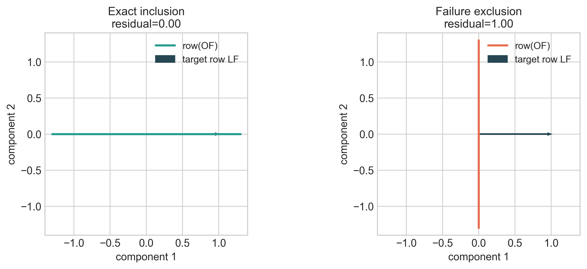
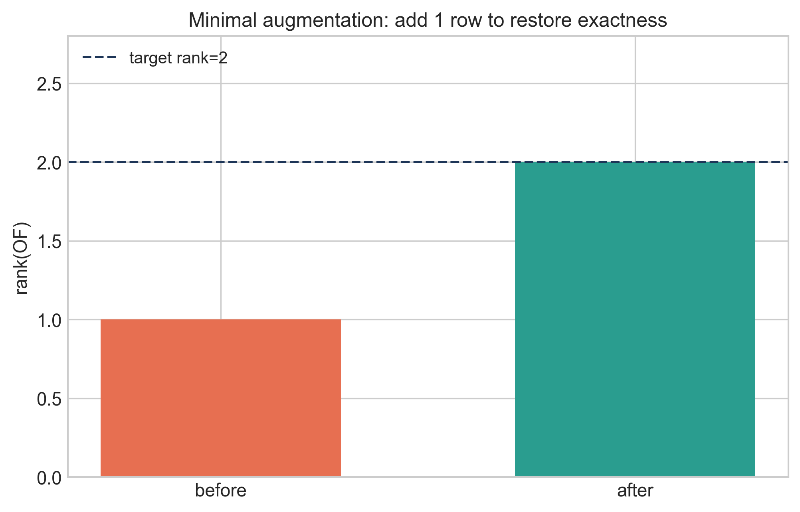
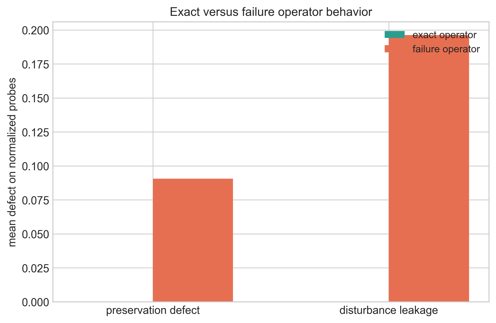

# Orthogonal Correction Principle in Restricted Linear Systems: A Foundational Companion Paper

Steven Reid  
Independent Researcher  
ORCID: 0009-0003-9132-3410  
sreid1118@gmail.com  
April 2026

## Abstract
This paper provides a concise foundational statement of the Orthogonal Correction Principle (OCP) in finite-dimensional linear settings. The central question is operator-structural: when does a correction map preserve the protected component while removing disturbance exactly? We give a complete characterization on a protected/disturbance decomposition and derive the restricted-linear recoverability criterion as a direct consequence. In the family `x=Fz` with observation `y=OFz` and protected target `p(x)=LFz`, exact linear decoding is equivalent to `ker(OF) \subseteq ker(LF)` (equivalently `row(LF) \subseteq row(OF)`). We then state the exact minimal augmentation law `delta(O,L;F)=rank([OF;LF]) - rank(OF)` as a design corollary and illustrate exact-versus-failure operator behavior on explicit witnesses. Scope is deliberate: this manuscript is a foundation companion; the broader anti-classifier and quantitative-threshold package is developed in the recoverability paper.

**Keywords:** orthogonal correction principle, exact correction, protected/disturbance decomposition, restricted-linear recoverability, row-space criterion, minimal augmentation

## 1. Introduction
The OCP program asks a narrowly defined question: can a correction operator remove disturbance without damaging a declared protected target? In this paper we present the foundational linear answer in compact form.

This manuscript is intentionally companion-scoped. It is not the full recoverability package. Instead, it provides:
1. the core exact-correction operator logic on protected/disturbance decompositions;
2. the restricted-linear criterion that makes exact recoverability computable;
3. a compact repair law (minimal augmentation) for design.

A separate theorem-heavy companion, `recoverability_paper_final.md`, develops the full anti-classifier and threshold program.

### 1.1 Contributions and Status Labels
- **PROVED (operator foundation):** Exact correction on `H = S \oplus D` is equivalent to projector structure (`C = P_{S//D}`), with the orthogonal case as a corollary.
- **PROVED (restricted-linear criterion):** Exact linear decoding exists iff `ker(OF) \subseteq ker(LF)` (equivalently `row(LF) \subseteq row(OF)`).
- **PROVED (design corollary):** `delta(O,L;F)` gives the minimum unrestricted linear augmentation count required for exact repair.
- **INTERPRETATION:** Compact geometric/defect visuals explain exact versus failure behavior without extending theorem scope.

## 2. Setup and Notation
Let `H` be a finite-dimensional real Hilbert space, and let
- `S \subset H` be the protected subspace,
- `D \subset H` be the disturbance subspace,
- `H = S \oplus D` be a declared direct-sum architecture,
- `C: H -> H` be a linear correction operator.

We call `C` **exact on `(S,D)`** if

`C(s + d) = s` for all `s in S`, `d in D`.

### Theorem 2.1 (Exact correction operator characterization)
For a linear `C`, the following are equivalent:
1. `C` is exact on `(S,D)`.
2. `C|_S = I_S` and `C|_D = 0`.
3. `C` equals the projector onto `S` along `D`, i.e. `C = P_{S//D}`.

#### Proof
`(1 => 2)` For `s in S`, write `s = s + 0`; exactness gives `C s = s`. For `d in D`, write `d = 0 + d`; exactness gives `C d = 0`.  
`(2 => 1)` For any `x = s + d`, linearity gives `C x = C s + C d = s + 0 = s`.  
`(2 <=> 3)` is the standard characterization of the oblique projector with range `S` and kernel `D`.

### Corollary 2.2 (Orthogonal OCP anchor)
If `D = S^\perp`, then the unique self-adjoint idempotent exact correction is the orthogonal projector `P_S`.

## 3. Restricted-Linear Recoverability Layer
Let admissible states be `A = {x = Fz : z in R^r}` with
- observation map `M(x) = O x`,
- protected target `p(x) = L x`.

Define restricted matrices `O_F := OF`, `L_F := LF`. A linear decoder `K` is exact on `A` when

`K O_F z = L_F z` for all `z`.

### Theorem 3.1 (Restricted-linear exactness criterion)
An exact linear decoder exists iff

`ker(O_F) \subseteq ker(L_F)`.

Equivalent row-space form:

`row(L_F) \subseteq row(O_F)`.

#### Proof
Necessity: if `K O_F = L_F`, then `O_F z = 0` implies `L_F z = K O_F z = 0`.  
Sufficiency: kernel inclusion implies each row of `L_F` annihilates `ker(O_F)`, hence each row belongs to `row(O_F)`. Therefore there exists `K` with `K O_F = L_F`.

### Corollary 3.2 (Minimal unrestricted augmentation)
Define

`delta(O,L;F) = rank([O_F; L_F]) - rank(O_F)`.

Then `delta` is exactly the minimum number of unrestricted added scalar linear measurements needed to make exact recovery possible on `A`.

#### Proof sketch
Each added row increases `rank(O_F)` by at most one; reaching inclusion requires recovering the missing rank in `row([O_F;L_F])`. This lower bound is tight by adding rows spanning the missing row-space complement.

## 4. Worked Examples and OCP Figures
### Example 4.1 (Row-space geometry: exact versus failure)
In the restricted-linear witness `F=I_2`, `L=[1,0]`, compare `O1=[1,0]` (exact) and `O2=[0,1]` (failure). Figure 1 shows inclusion (`row(LF) ⊆ row(OF)`) versus exclusion in direct geometry.

Figure 1. OCP row-space geometry: exact inclusion (left) and failure exclusion (right).

### Example 4.2 (Minimal augmentation repair)
Starting from the failure case `O2=[0,1]`, one added informative row restores exactness. Figure 2 visualizes the rank repair:
- before: rank-deficient for target recovery,
- after: augmented row-space closes the exactness deficit.

Figure 2. OCP minimal augmentation visualization: rank repair by one added row (`delta=1`).

### Example 4.3 (Exact vs failure operator behavior)
On normalized protected/disturbance probes, compare an exact correction operator with a misaligned failure operator. Figure 3 reports preservation defect and disturbance leakage side-by-side.

Figure 3. Exact versus failure operators under OCP defect metrics.

## 5. Interpretation and Companion Positioning
This paper contributes the operator spine of OCP:
1. exact correction is projector structure (`P_{S//D}`),
2. restricted-linear exactness is row-space inclusion,
3. design repair is minimal augmentation rank deficit.

The recoverability companion paper carries the broader theorem package (fiber criterion, no rank-only classifier, no budget-only classifier, threshold laws, and quantitative obstruction). The bridge and MHD papers apply the same structure in PDE/projection and Euler-potential closure domains without claiming universality.

## 6. Related Work
The operator criterion connects to classical projection and observability ideas in linear systems and control. Kernel/row-space formulations are standard linear algebra, while minimal augmentation is aligned with structural sensor placement and functional observability perspectives.

### 6.1 Position Relative to Existing Work
The operator ingredients are classical: oblique/orthogonal projectors, kernel inclusion criteria, and row-space formulations in finite-dimensional recovery. What is likely distinct here is not a new algebraic identity, but the scoped packaging: one compact companion manuscript that connects exact correction architecture, exact recoverability criterion, and exact augmentation count with explicit witness examples and strict scope boundaries.

## 7. Limitations and Scope
1. Finite-dimensional linear scope only.
2. Restricted-linear admissible families `x=Fz`.
3. No universal nonlinear, stochastic, or PDE-wide claims.
4. Budget/anti-classifier depth is deferred to the recoverability companion paper.

## 8. Conclusion
OCP exactness in linear settings is not an amount statement; it is a structural statement. Exact correction corresponds to projector compatibility, exact recoverability to row-space inclusion, and repair to a precise rank-deficit augmentation law.

## 9. Administrative Statements
### 9.1 Funding
This research received no external funding.

### 9.2 AI Usage Statement
Generative AI tools were used for code generation, refactoring assistance, testing support, visualization scripting, and drafting assistance. Mathematical claims, derivations, validation logic, and final content were reviewed and verified by the author.

### 9.3 Data and Code Availability
Primary repository for this paper: https://github.com/RRG314/Protected-State-Correction-Theory.  
Public workbench entrypoint: https://rrg314.github.io/Protected-State-Correction-Theory/docs/workbench/

### 9.4 Conflict of Interest
The author declares no conflict of interest.

### 9.5 Reproducibility Note
Figures are generated and validated through:
- `python scripts/figures/generate_publication_figures.py`
- `python scripts/figures/validate_publication_figures.py`

## 10. References
1. R. E. Kalman, “A new approach to linear filtering and prediction problems,” *Transactions of the ASME—Journal of Basic Engineering*, 82(1) (1960), 35–45. DOI: 10.1115/1.3662552.
2. C.-T. Lin, “Structural controllability,” *IEEE Transactions on Automatic Control*, 19(3) (1974), 201–208. DOI: 10.1109/TAC.1974.1100557.
3. A. J. Krener and R. Hermann, “Nonlinear controllability and observability,” *IEEE Transactions on Automatic Control*, 22(5) (1977), 728–740. DOI: 10.1109/TAC.1977.1101601.
4. Y. Zhang, T. Fernando, and M. Darouach, “Functional observability, structural functional observability and optimal sensor placement,” arXiv:2307.08923, 2023. URL: https://arxiv.org/abs/2307.08923.
5. P. Dey, N. Balachandran, and D. Chatterjee, “Efficient constrained sensor placement for observability of linear systems,” *IEEE Control Systems Letters*, 5(3) (2021), 927–932. Preprint: https://arxiv.org/abs/1711.08264.

## Appendix A. Companion-Paper Orientation
- Full recoverability theorem package: `papers/recoverability_paper_final.md`.
- Projection/PDE bridge lane: `papers/bridge_paper.md`.
- MHD domain lane: `papers/mhd_paper_upgraded.md`.
