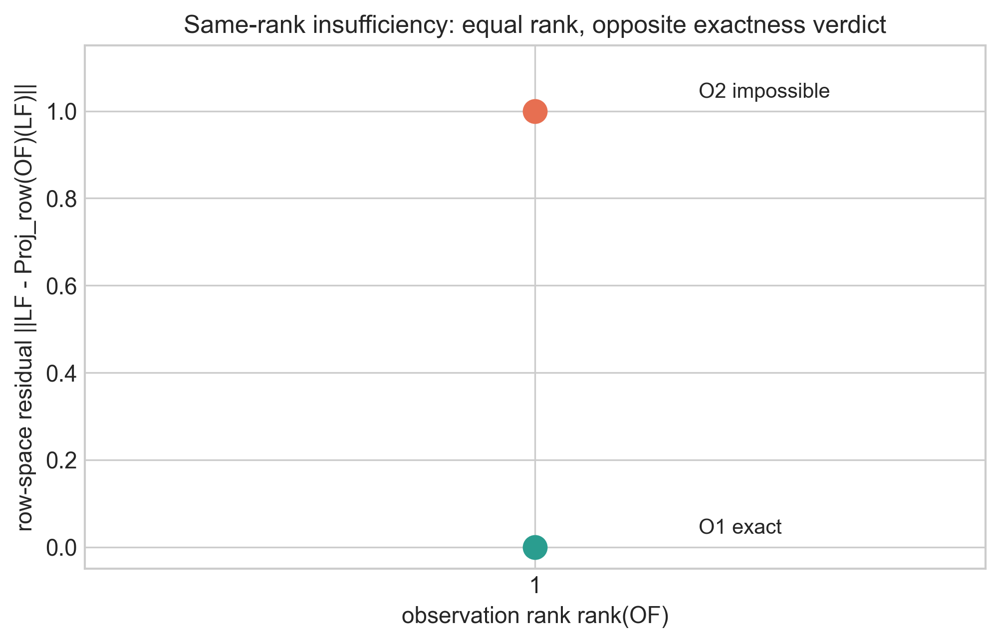
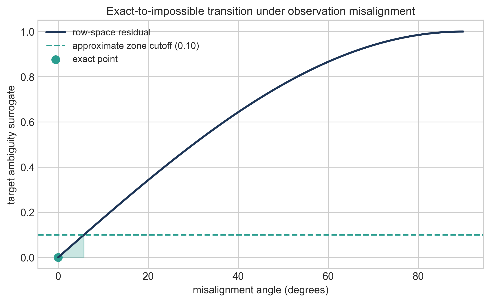
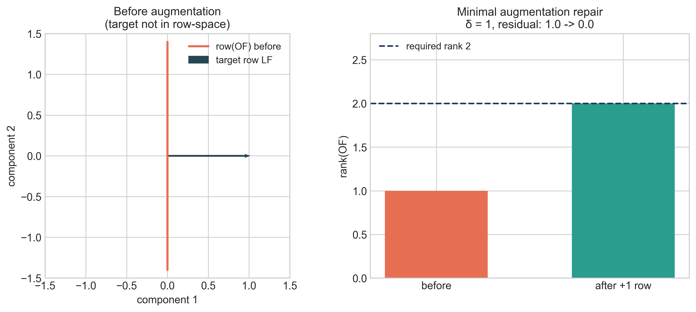

# Recoverability Under Constrained Observation: Fiber Factorization, Thresholds, and Minimal Augmentation

Steven Reid  
Independent Researcher  
ORCID: 0009-0003-9132-3410  
sreid1118@gmail.com  
April 2026

## Abstract
We study exact target recoverability under constrained observation, with emphasis on finite-dimensional restricted-linear families where exact classification and design are computable. For a general admissible family with record map `M` and target `tau`, we prove that exact recoverability is equivalent to fiber constancy, equivalently to factorization `tau = R o M` on the admissible set. In the restricted-linear class `x = Fz`, `y = OFz`, `tau(x) = LFz`, we obtain the exact criterion `ker(OF) \subseteq ker(LF)` (equivalently `row(LF) \subseteq row(OF)`). We then establish three impossibility results for amount-only language: same-rank systems can have opposite exactness verdicts; no rank-only exact classifier exists on the class; and no fixed-library equal-budget/equal-count exact classifier exists. To move beyond binary exact/impossible labels, we develop a quantitative obstruction layer based on collapse and collision structure, including a nested collision-gap threshold law. We also formalize target sensitivity (weaker target recoverable, stronger target impossible under the same record) and prove the exact minimal augmentation law `delta(O,L;F)=rank([OF;LF]) - rank(OF)`. Scope is explicit: constructive design conclusions are strongest in restricted-linear settings, and no universal inverse-problem classifier is claimed.

**Keywords:** exact recoverability, constrained observation, fiber criterion, row-space criterion, rank insufficiency, budget insufficiency, collision gap, minimal augmentation

## 1. Introduction
Recoverability questions are often framed in amount language: higher rank, more sensors, or larger budget are treated as proxies for exact target reconstruction. In many practical settings this is useful as a heuristic, but it is not an exact classifier.

This paper develops a theorem-first recoverability package in a constrained-observation setting. The scope is disciplined:
1. We first establish the general exact criterion in fiber/factorization form.
2. We then specialize to a restricted-linear class where exactness, impossibility, thresholds, and design are all computable.
3. We prove anti-classifier no-go theorems showing that rank-only and fixed-budget-only logic fails for exact classification.
4. We provide an exact minimal augmentation law for repair.

A concise foundational companion paper, `papers/ocp_core_paper.md`, presents the operator-level OCP spine (exact correction projector logic plus restricted-linear criterion) without the full anti-classifier/threshold expansion developed here.

The central message is structural: exact recoverability is governed by how record fibers align with target variation, not by observation amount alone.

### 1.1 Contributions and Status Labels
- **PROVED (general setting):** Exact recoverability is equivalent to fiber constancy/factorization of `tau` through the record map `M`; this gives the conceptual backbone for all later specialization.
- **PROVED (restricted-linear setting):** Exactness is equivalent to `ker(OF) \subseteq ker(LF)` (equivalently `row(LF) \subseteq row(OF)`); this turns recoverability into a directly testable linear criterion.
- **PROVED (classification limits):** Same-rank systems can yield opposite verdicts, and rank-only or fixed-budget-only exact classifiers fail on the supported class; this rules out amount-only exact criteria.
- **PROVED (quantitative layer):** Collision/collapse quantities produce explicit obstruction bounds and a nested collision-gap threshold law; this adds measurable transition structure beyond binary labels.
- **PROVED (design law):** `delta(O,L;F)` is the exact minimum unrestricted linear augmentation count needed for repair; this yields a constructive correction-design rule.
- **INTERPRETATION:** Structure-first guidance follows from the proved criteria; no interpretation is promoted as theorem.

## 2. Problem Setup and Notation
Let:
- `A` be an admissible family of states,
- `M: A -> Y` be the observation (record) map,
- `tau: A -> P` be the target map.

### 2.1 Exact Recoverability
`tau` is exactly recoverable from `M` on `A` if there exists `R: M(A) -> P` such that

`R(M(x)) = tau(x)` for all `x in A`.

### 2.2 Fiber Notation
For `y in M(A)`, define the record fiber:

`F_y := { x in A : M(x) = y }`.

### 2.3 Restricted-Linear Class
For finite-dimensional analysis, we use

`x = Fz`, `z in R^r`,

with linear observation and target

`M(x) = Ox`, `tau(x)=Lx`.

On coefficient space:

`y = OFz`, `tau = LFz`.

Exact linear recovery asks whether there exists `K` such that

`KOF = LF`.

### 2.4 Quantitative Obstruction Objects
For metrics `d_Y`, `d_P`, define the collapse modulus

`kappa_{M,tau}(eps) := sup { d_P(tau(x),tau(x')) : d_Y(M(x),M(x')) <= eps }`.

In nested restricted-linear families (Section 6), define the structured collision gap

`Gamma_r(B) := sup { ||LFh|| : ||h||_inf <= 2B, O_r F h = 0 }`.

## 3. Main Exact Recoverability Theorem

### Theorem 3.1 (Fiber Constancy / Factorization Criterion)
Let `A`, `M`, and `tau` be as above. The following are equivalent:
1. `tau` is exactly recoverable from `M` on `A`.
2. `tau` is constant on every fiber of `M`.
3. There exists `R: M(A) -> P` such that `tau = R o M` on `A`.

**Status:** `PROVED` (recoverability branch exact backbone).

#### Proof
`(1 => 2)` If `R(M(x)) = tau(x)` for all `x`, and `M(x)=M(x')`, then
`tau(x)=R(M(x))=R(M(x'))=tau(x')`.

`(2 => 3)` For each `y in M(A)`, pick any `x_y in A` with `M(x_y)=y` and set `R(y):=tau(x_y)`.
Fiber constancy makes this well-defined.

`(3 => 1)` Immediate from `tau=R o M`.

### Corollary 3.2 (Exactness via Zero-Fiber Ambiguity)
`tau` is exactly recoverable iff `kappa_{M,tau}(0)=0`.

**Status:** `PROVED`.

#### Proof
`kappa_{M,tau}(0)` is the supremum target discrepancy over equal-record pairs. It is zero iff all equal-record pairs have equal target value, which is exactly Theorem 3.1(2).

## 4. Restricted-Linear Theorem Layer

### Theorem 4.1 (Restricted-Linear Exactness Criterion)
For `x=Fz`, `M(x)=Ox`, and `tau(x)=Lx`, exact linear recovery on `range(F)` exists iff

`ker(OF) \subseteq ker(LF)`.

Equivalent form:

`row(LF) \subseteq row(OF)`.

**Status:** `PROVED` (OCP-031).

#### Proof
If `KOF=LF`, then for any `z` with `OFz=0`, `LFz=KOFz=0`, so `ker(OF) \subseteq ker(LF)`.

Conversely, assume `ker(OF) \subseteq ker(LF)`. Define `T` on `im(OF)` by `T(OFz)=LFz`.
This is well-defined: if `OFz=OFz'`, then `OF(z-z')=0`, so `LF(z-z')=0`, hence `LFz=LFz'`.
Extend `T` linearly to all of observation space as `K`. Then `KOF=LF`.

Row-space equivalence follows from finite-dimensional linear duality:
`ker(A) \subseteq ker(B)` iff `row(B) \subseteq row(A)`.

### Corollary 4.2 (Necessary Rank Bound)
Exact linear recovery implies `rank(OF) >= rank(LF)`.

**Status:** `PROVED` (necessary only).

#### Proof
`row(LF) \subseteq row(OF)` implies `dim row(LF) <= dim row(OF)`.

### 4.3 Central Structure: One Spine, Three Levels
The paper's core structure is the same statement expressed at three levels of specificity:

1. **General fiber level:** exactness is equivalent to target constancy on record fibers (`tau = R o M` on `A`).
2. **Restricted-linear level:** fiber constancy becomes `ker(OF) \subseteq ker(LF)`, equivalently `row(LF) \subseteq row(OF)`.
3. **Design/repair level:** when row-space inclusion fails, the exact deficit is
   `delta(O,L;F)=rank([OF;LF]) - rank(OF)`,
   which is the minimum unrestricted augmentation needed to restore exactness.

This gives one coherent progression:

`fiber constancy -> row-space inclusion -> minimal augmentation`.

The progression is theorem-backed by Theorem 3.1, Theorem 4.1, and Theorem 8.1.

Figure 1 visualizes this inclusion-versus-exclusion geometry on the canonical two-dimensional witness pair.

Figure 1. Row-space inclusion versus exclusion for the canonical restricted-linear pair. Left: target row lies in `row(OF)` (exact). Right: target row lies outside `row(OF)` (failure).

## 5. Negative Results and Impossibility

### Theorem 5.1 (Same-Rank Insufficiency)
Fix `n > r >= 1` and `r <= k < n`. There exist restricted-linear instances with the same `n`, same `rank(LF)=r`, and same `rank(OF)=k`, but opposite exactness verdicts.

**Status:** `PROVED` (OCP-047).

#### Proof
Use coefficient coordinates (`F=I_n`) and set

`L = [I_r  0]`.

Construct `O_exact` so `row(L) \subseteq row(O_exact)` and `rank(O_exact)=k` (add `k-r` arbitrary independent rows).
Then exactness holds by Theorem 4.1.

Construct `O_fail` with `rank(O_fail)=k` whose row space omits at least one direction from `row(L)`.
Then `row(L) \nsubseteq row(O_fail)`, so exactness fails.

Both have rank `k`, with opposite verdicts.

### Theorem 5.2 (No Rank-Only Exact Classifier)
There is no classifier `C(n, rank(LF), rank(OF))` that correctly decides exact recoverability for all restricted-linear instances.

**Status:** `PROVED` (OCP-049).

#### Proof
If such `C` existed, any two instances with equal tuple `(n, rank(LF), rank(OF))` would share a verdict.
Theorem 5.1 gives same-tuple opposite-verdict pairs, contradiction.

### Theorem 5.3 (No Fixed-Library Budget-Only Exact Classifier)
In a fixed candidate measurement library with equal per-measurement cost, equal cardinality (thus equal budget) does not determine exact recoverability.

**Status:** `PROVED` (OCP-050).

#### Proof
Take coordinate library rows `{e_1^T,...,e_n^T}`, `F=I_n`, and target `L=[e_1^T]`.
For budget/count `k=1`, choose
- `S_exact={e_1^T}`: exact,
- `S_fail={e_2^T}`: impossible.

Both selections have identical cost and size, opposite verdicts.
The same construction extends to any `k` with `1 <= k < n` by adding common extra rows that do not alter the inclusion/exclusion of the target row direction.

Figure 2 shows the same-rank insufficiency witness directly: both systems have `rank(OF)=1`, but one is exact and the other is impossible.

Figure 2. Same-rank insufficiency: two observation systems with identical rank but different row-space residual and opposite exactness verdict.

## 6. Quantitative Obstruction
This section provides measurable ambiguity structure beyond binary exact/impossible labels.

### Theorem 6.1 (Adversarial Noise Lower Bound)
For any estimator `hat_tau: Y -> P` receiving records with perturbation radius `eta` (`d_Y(y,M(x)) <= eta`),

`sup_x sup_{d_Y(y,M(x))<=eta} d_P(hat_tau(y), tau(x)) >= kappa_{M,tau}(eta)/2`.

**Status:** `PROVED` (OCP-035).

#### Proof
Fix `x,x'` with `d_Y(M(x),M(x')) <= eta` and target separation near `kappa(eta)`.
Choose an admissible record `y` that can arise from either state under the noise radius.
By triangle inequality, at least one of `d_P(hat_tau(y),tau(x))` or `d_P(hat_tau(y),tau(x'))` is at least half of `d_P(tau(x),tau(x'))`.
Take suprema.

### Theorem 6.2 (Nested Restricted-Linear Collision-Gap Threshold Law)
Let nested observations satisfy

`row(O_1F) \subseteq row(O_2F) \subseteq ... \subseteq row(O_RF)`

on box family `A_B={Fz: ||z||_inf <= B}`.
Define

`Gamma_r(B) = sup { ||LFh|| : ||h||_inf <= 2B, O_rFh=0 }`.

Then:
1. `Gamma_r(B)` is nonincreasing in `r`.
2. Exact recovery at level `r` holds iff `Gamma_r(B)=0`.
3. The first exact level is

`r_* = min { r : Gamma_r(B)=0 } = min { r : row(LF) \subseteq row(O_rF) }`.

4. For zero-noise decoding at level `r`, worst-case error is at least `Gamma_r(B)/2`.

**Status:** `PROVED` (OCP-043, restricted-linear scope).

#### Proof sketch
Monotonicity follows because enlarging row space shrinks `ker(O_rF)`, hence shrinks the feasible set in the supremum.

`Gamma_r=0` iff every kernel direction carries zero target variation, i.e. `ker(O_rF) \subseteq ker(LF)`, equivalent to row-space inclusion by Theorem 4.1.

Lower bound is a direct two-point collision argument on admissible coefficient differences `h` in the feasible set.

### Proposition 6.3 (Exact-Regime Upper Envelope)
If exactness holds and `KOF=LF`, then under Euclidean norms

`kappa_{M,tau}(eps) <= ||K||_2 eps`.

**Status:** `PROVED` (OCP-046, exact restricted-linear regime).

#### Proof
For any admissible pair,
`tau(x)-tau(x') = K(M(x)-M(x'))`, so
`||tau(x)-tau(x')|| <= ||K||_2 ||M(x)-M(x')||`.
Take supremum over pairs with record discrepancy at most `eps`.

### 6.4 Integrated Obstruction Picture
The quantitative layer is not a separate add-on; it is the metric version of the same fiber logic:

- `kappa_{M,tau}(0)=0` is exactness.
- `kappa_{M,tau}(eta)/2` is an adversarial impossibility floor under record error radius `eta`.
- `Gamma_r(B)` is the restricted-linear collision geometry on bounded coefficient families.
- the first level where `Gamma_r(B)=0` is exactly the exactness threshold for that nested record family.

Together these quantities separate:
- **binary exactness** (`kappa(0)=0`),
- **below-threshold impossibility** (`Gamma_r(B)>0`),
- **exact-but-noisy stability envelope** (`kappa(eps) <= ||K||_2 eps` when exactness holds).

### 6.5 Regime Classification in the Supported Recoverability Program

| Regime | Structural criterion | Quantitative signature | Status in this paper |
| --- | --- | --- | --- |
| exact | target constant on fibers | `kappa(0)=0` and (restricted-linear) `Gamma_r(B)=0` | `PROVED` |
| approximate (stable) | exactness may fail, but bounded decoder error is targeted | lower bound `>= kappa(eta)/2`; upper envelope available in exact restricted-linear regime | lower bound `PROVED`; general stability program `CONDITIONAL` |
| asymptotic | exact one-shot may fail but long-horizon observer/record refinement can converge | family-dependent threshold/horizon mechanisms | `VALIDATED` in branch examples, not promoted here as universal theorem |
| impossible | at least one fiber mixes target values | `kappa(0)>0`; in nested linear families `Gamma_r(B)>0` below threshold | `PROVED` in stated scopes |

Figure 3 shows the computed nested collision-gap profile `Gamma_r(B)` and the exactness threshold `r_*`. Figure 4 shows a continuous alignment-driven transition from exact (`theta=0`) to impossible (`theta>0`) in the canonical one-row observation family.

Figure 3. Collision-gap threshold law on a nested restricted-linear family: `Gamma_r(B)` decreases and vanishes exactly at the first exact level.

Figure 4. Exact-to-impossible transition under observation misalignment: ambiguity surrogate rises with row-space misalignment angle.

## 7. Strong-vs-Weak Target Split
Recoverability is target-sensitive, not record-only.

### Theorem 7.1 (Coarsening Monotonicity)
If `q = phi o tau` and `tau` is exactly recoverable from `M`, then `q` is exactly recoverable from `M`.

**Status:** `PROVED` (target hierarchy backbone).

#### Proof
If `tau = R o M`, then `q = phi o R o M`.

### Proposition 7.2 (Same Record, Opposite Target Verdicts in Restricted-Linear Form)
For fixed `O,F`, choose two targets `tau_w(x)=L_wx` and `tau_s(x)=L_sx` such that

`row(L_wF) \subseteq row(OF)` but `row(L_sF) \nsubseteq row(OF)`.

Then `tau_w` is exactly recoverable while `tau_s` is not.

**Status:** `PROVED` (OCP-041/OCP-048 structural form).

#### Proof
Apply Theorem 4.1 separately to each target.

### Theorem 7.3 (Noisy Weak-vs-Strong Separation on Restricted Families)
Assume:
1. weak target exactness: `KOF = W F`,
2. strong target positive collision floor on bounded family: `Gamma_s(B) > 0`.

Then for record noise `||e|| <= eta`:
- weak target error admits upper bound `<= ||K||_2 eta`,
- every decoder for the strong target has worst-case error `>= Gamma_s(B)/2`.

Hence for `eta < Gamma_s(B)/(2||K||_2)`, weak-target stability can remain strictly below the strong-target impossibility floor.

**Status:** `PROVED` in branch scope (OCP-051).

## 8. Minimal Augmentation Theorem
This section gives an exact design law for repair.

### Theorem 8.1 (Minimal Unrestricted Linear Augmentation)
For restricted-linear problem `(O,L,F)`, define

`delta(O,L;F) = rank([OF;LF]) - rank(OF)`.

Then `delta(O,L;F)` is exactly the minimum number of unrestricted added scalar linear measurements required to make exact recovery possible.

**Status:** `PROVED` (OCP-045).

#### Proof
Let `O_aug = [O; A]` where `A` is the added block.
Exactness for the augmented system requires

`row(LF) \subseteq row(O_aug F)`.

So `row(O_aug F)` must span the joined space `row([OF;LF])`. Starting from dimension `rank(OF)`, at least

`rank([OF;LF]) - rank(OF)`

new independent row directions are necessary. This gives necessity.

For sufficiency, choose `A` so that rows of `AF` add exactly a complementary basis of `row([OF;LF])` beyond `row(OF)`. Then

`row(LF) \subseteq row([OF;AF])`,

and exactness follows from Theorem 4.1.

Thus the minimum equals `delta(O,L;F)`.

### Interpretation
`delta` is a structure deficit, not an amount heuristic:
- `delta=0`: already exact.
- `delta>0`: exactness impossible without adding at least `delta` new independent informative directions.

Figure 5 shows this repair law on the canonical failure witness: before augmentation, the target direction is outside `row(OF)`; after adding one informative row, the rank deficit closes (`delta=1`) and exactness is restored.

Figure 5. Minimal augmentation repair: before/after visualization of the rank deficit and exactness restoration.

## 9. Worked Examples
All examples are finite-dimensional and exact.

### Example 9.1 (Exact Recoverability)
Take

`F=I_2`, `O=[1 0]`, `L=[1 0]`.

Then `row(LF)=row(OF)`, so exactness holds; decoder `K=[1]` satisfies `KOF=LF`.

### Example 9.2 (Failure by Hidden Target Direction)
Take

`F=I_2`, `O=[0 1]`, `L=[1 0]`.

Then `ker(OF)=span{e_1}` but `LF e_1=1`, so `ker(OF) \nsubseteq ker(LF)`.
Exact recovery fails.

### Example 9.3 (Same Rank, Opposite Verdict)
Use the same `F=I_2`, `L=[1 0]`, with

`O_1=[1 0]`, `O_2=[0 1]`.

Both have rank 1.
- `O_1`: exact (`row(L) \subseteq row(O_1)`).
- `O_2`: impossible (`row(L) \nsubseteq row(O_2)`).

This is the minimal witness for Theorem 5.1.

### Example 9.4 (Weak vs Strong Target on Same Record)
Take `F=I_2`, `O=[1 0]`.
Define
- weak target `tau_w(x)=x_1` (`L_w=[1 0]`),
- strong target `tau_s(x)=x_2` (`L_s=[0 1]`).

Then weak target is exact; strong target is impossible. Same record, different target verdict.

### Example 9.5 (Minimal Augmentation Repair)
Start from Example 9.2 (`O=[0 1]`, `L=[1 0]`, `F=I_2`).

`rank(OF)=1`,
`rank([OF;LF])=2`, so `delta=1`.

Add one row `[1 0]` to observation; augmented row space contains target row, and exactness is restored.
No zero-row augmentation can work, so one added measurement is minimal.

### Example 9.6 (Threshold Transition in a Nested Record Family)
Let `F=I_2`, `L=[0 1]`, and bounded coefficients `||z||_inf <= B`.
Define nested records:
- level `r=1`: `O_1=[1 0]`,
- level `r=2`: `O_2=I_2`.

At level `r=1`, `row(LF) \nsubseteq row(O_1F)`, so exact recovery fails and
`Gamma_1(B)=sup{|h_2|: |h_i|<=2B, h_1=0}=2B>0`.

At level `r=2`, `row(LF) \subseteq row(O_2F)` and
`Gamma_2(B)=0`.

This is an explicit exact/no-go threshold transition: the minimal exact level is `r_*=2`.

## 10. Interpretation and Implications
The theorem package yields practical rules for exact recoverability design in constrained linear settings:
1. **Check fibers/row spaces first.** Exactness is a structural condition, not a data-volume condition.
2. **Use anti-classifier warnings.** Equal rank or equal budget does not certify equal recoverability.
3. **Quantify ambiguity.** `kappa` and `Gamma_r(B)` distinguish catastrophic collision regimes from near-exact regimes.
4. **Repair by deficit, not by guesswork.** `delta(O,L;F)` gives an exact minimum unrestricted augmentation count.
5. **Choose target granularity explicitly.** Coarsened targets can be exact when stronger targets are impossible.

These are theorem-backed within the stated branch scope.

## 11. Limitations and Scope
1. The strongest exact design results are restricted-linear (`x=Fz`) and finite-dimensional.
2. The general fiber/factorization criterion is broad, but constructive formulas (thresholds, augmentation counts) are proved in supported restricted classes.
3. The no rank-only and no budget-only theorems are exact-classification failures on the supported class; no universal claim over all nonlinear inverse problems is made.
4. The collision-gap threshold law is stated on bounded coefficient families with nested record operators.
5. This paper does not claim a universal recoverability scalar that classifies all systems.

## 12. Related Work
This paper is adjacent to several established literatures.

### 12.1 Observability and Structural Criteria
Classical observability results in linear systems (Kalman-type rank conditions) and structural controllability/observability perspectives motivate rank- and structure-based analysis, but they do not by themselves provide the target-specific anti-classifier package developed here.

### 12.2 Functional Observability and Sensor Placement
Recent functional observability and constrained sensor placement work emphasizes recovering specific functionals under constraints. The restricted-linear criterion here (`row(LF) \subseteq row(OF)`) is aligned with that tradition; this paper's distinct emphasis is the combined no-go package (same-rank insufficiency, no rank-only classifier, no fixed-library budget-only classifier) plus an exact minimal unrestricted augmentation count.

### 12.3 Inverse-Problem Stability Viewpoint
The collapse-modulus lower bound is consistent with inverse-problem stability logic: indistinguishable records impose irreducible estimation floors. In this paper it is integrated with exactness/failure thresholds and target-sensitive design.

### 12.4 Identifiability and Model-Structure Perspective
The paper is also aligned with identifiability literature in one specific way: exact target recovery is a map-identifiability claim on an admissible family, and failure is a structural non-identifiability induced by fiber collisions. The restricted-linear results sharpen this into computable row-space criteria and anti-classifier no-go theorems.

### 12.5 Signal-Recovery and Sparse-Information Context
Signal-recovery work emphasizes that structure (not just sample count) controls exact reconstruction. Our setting is different in objective (target recoverability on admissible families rather than generic sparse vector reconstruction), but the same amount-versus-structure distinction appears here in theorem form.

### 12.6 Novelty Discipline
Likely standard background ingredients:
- fiber/factorization exactness logic,
- linear kernel/row-space criterion.

Likely paper-distinct contribution package (within stated scope):
- theorem-grade anti-classifier triad,
- collision-threshold plus upper/lower quantitative envelope in one recoverability spine,
- exact minimal augmentation law positioned as a design theorem.

### 12.7 Position Relative to Existing Work
The foundational ingredients are standard: factorization/fiber logic in map-based identifiability and kernel/row-space criteria in finite-dimensional linear recovery. This paper's contribution is the scoped theorem package that combines these ingredients with three classifier-failure results, a quantitative collision-threshold layer, and an exact augmentation design law in one coherent framework. The likely distinctive part is this integrated negative-plus-design package under explicit scope control. The paper does not claim a universal recoverability law across nonlinear inverse problems.

## 13. Conclusion
Exact recoverability under constrained observation is governed by structure: target variation must be constant on record fibers, and in restricted-linear families this is exactly row-space inclusion. Rank/count/budget summaries alone are insufficient for exact classification. Quantitative ambiguity can be measured through collapse and collision objects, and exact failure can be repaired constructively through the minimal augmentation law. The framework is intentionally narrow, theorem-first, and scoped to claims that are defensible on the supported families.

## 14. Administrative Statements
### 14.1 Funding
This research received no external funding.

### 14.2 AI Usage Statement
Generative AI tools were used for code generation, refactoring assistance, testing support, visualization scripting, and drafting assistance. Mathematical claims, derivations, validation logic, and final content were reviewed and verified by the author.

### 14.3 Data and Code Availability
Primary repository for this paper: https://github.com/RRG314/Protected-State-Correction-Theory.  
Public workbench: https://rrg314.github.io/Protected-State-Correction-Theory/docs/workbench/  
Figure-generation and validation scripts used in this paper are in `scripts/figures/` and `scripts/validate/` of the same repository.

### 14.4 Conflict of Interest
The author declares no conflict of interest.

### 14.5 Reproducibility Note
All figures in this manuscript are generated from explicit formulas or finite constructions using:
- `python scripts/figures/generate_publication_figures.py`
- `python scripts/figures/validate_publication_figures.py`
The corresponding metrics and validation outputs are stored under `data/generated/figures/`.

## 15. References
1. R. E. Kalman, “A new approach to linear filtering and prediction problems,” *Transactions of the ASME—Journal of Basic Engineering*, 82(1) (1960), 35–45. DOI: 10.1115/1.3662552.
2. A. J. Krener and R. Hermann, “Nonlinear controllability and observability,” *IEEE Transactions on Automatic Control*, 22(5) (1977), 728–740. DOI: 10.1109/TAC.1977.1101601.
3. L. Ljung and T. Glad, “On global identifiability for arbitrary model parametrizations,” *Automatica*, 30(2) (1994), 265–276. DOI: 10.1016/0005-1098(94)90039-6.
4. E. Walter and L. Pronzato, *Identification of Parametric Models from Experimental Data*, Springer, Berlin, 1997.
5. A. N. Tikhonov and V. Y. Arsenin, *Solutions of Ill-Posed Problems*, Winston, Washington, DC, 1977.
6. H. W. Engl, M. Hanke, and A. Neubauer, *Regularization of Inverse Problems*, Kluwer, Dordrecht, 1996.
7. Y. Zhang, T. Fernando, and M. Darouach, “Functional observability, structural functional observability and optimal sensor placement,” arXiv:2307.08923, 2023. URL: https://arxiv.org/abs/2307.08923.
8. P. Dey, N. Balachandran, and D. Chatterjee, “Efficient constrained sensor placement for observability of linear systems,” *IEEE Control Systems Letters*, 5(3) (2021), 927–932. Preprint: https://arxiv.org/abs/1711.08264.
9. E. J. Candès, J. Romberg, and T. Tao, “Robust uncertainty principles: Exact signal reconstruction from highly incomplete frequency information,” *IEEE Transactions on Information Theory*, 52(2) (2006), 489–509. DOI: 10.1109/TIT.2005.862083.
10. D. L. Donoho, “Compressed sensing,” *IEEE Transactions on Information Theory*, 52(4) (2006), 1289–1306. DOI: 10.1109/TIT.2006.871582.

## 16. Appendix A. Mapping to Repository Claim IDs
- Theorem 3.1 / Corollary 3.2: OCP-030.
- Theorem 4.1 / Corollary 4.2: OCP-031 and OCP-036.
- Theorem 5.1: OCP-047.
- Theorem 5.2: OCP-049.
- Theorem 5.3: OCP-050.
- Theorem 6.1: OCP-035.
- Theorem 6.2: OCP-043.
- Proposition 6.3: OCP-046.
- Theorem 7.1 / Proposition 7.2 / Theorem 7.3: OCP-048, OCP-041, OCP-051.
- Theorem 8.1: OCP-045.
